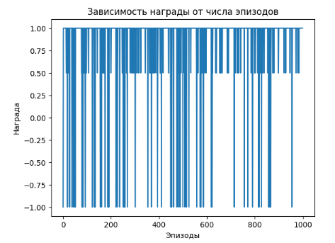

# Крестики-нолики с использованием Q-Learning

Этот проект реализует игру "Крестики-нолики" с использованием алгоритма Q-Learning для обучения агента. Агент обучается на основе вознаграждений, чтобы улучшить свои решения.

## Установка

Для запуска программы убедитесь, что у вас установлен Python, а также следующие библиотеки:
```bash
pip install numpy matplotlib
```

## Как запустить

1. Сохраните код в файл с именем `tic_tac_toe.py`.
2. Запустите файл:
   ```bash
   python tic_tac_toe.py
   ```
3. Программа будет выводить состояние доски на каждом шаге и строить график наград после обучения.

## Особенности

- **Логика игры:** Полная реализация "Крестиков-ноликов" с проверкой победителя и доступных ходов.
- **Агент с Q-Learning:** Агент использует алгоритм Q-Learning для обучения оптимальным стратегиям игры.
- **Визуализация:** Процесс обучения визуализируется через график наград.

## Структура файлов

- `tic_tac_toe.py`: Содержит полную реализацию игры и агента Q-Learning.
- `README.md`: Инструкции по использованию проекта.

## Параметры

- `episodes`: Количество эпизодов обучения (по умолчанию: 1000).
- `alpha`: Скорость обучения агента.
- `gamma`: Коэффициент дисконтирования для будущих наград.
- `epsilon`: Уровень исследования для ε-greedy стратегии.

## Пример результата

Во время обучения программа отображает состояние доски, а также строит график наград для визуализации прогресса обучения.



## Благодарности

Этот проект демонстрирует основы обучения с подкреплением в простом окружении и является образовательным примером для начинающих.
