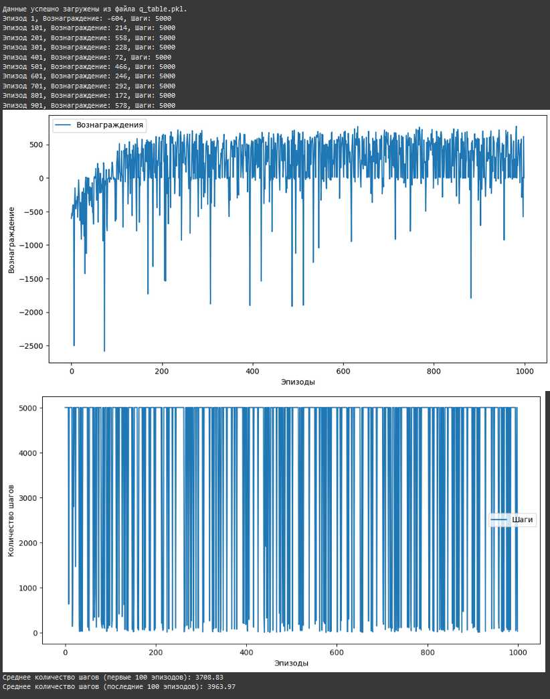

## Практика #4 Золотов А.А. Лисин С.В. Крапивин Я.С. (БСМО-11-24) 

# Балансировка стаканов с использованием Q-Learning

Этот проект реализует задачу балансировки количества жидкости в пяти стаканах с использованием алгоритма Q-Learning. Агент обучается на основе вознаграждений, чтобы минимизировать количество действий и уравнять уровень жидкости во всех стаканах.

## Особенности

- **Логика задачи:** Полная реализация алгоритма Q-Learning для балансировки жидкости в стаканах.
- **Агент с Q-Learning:** Агент использует алгоритм Q-Learning для обучения оптимальным действиям.
- **Визуализация:** Процесс обучения визуализируется через график наград и количество шагов.

## Структура файлов

- `balance_glasses.py`: Содержит полную реализацию задачи и агента Q-Learning.
- `README.md`: Инструкции по использованию проекта.

## Параметры

- `episodes`: Количество эпизодов обучения (по умолчанию: 1000).
- `alpha`: Скорость обучения агента.
- `gamma`: Коэффициент дисконтирования для будущих наград.
- `epsilon`: Уровень исследования для ε-greedy стратегии.

## Пример результата

Во время обучения программа отображает состояние стаканов, а также строит график наград и шагов для визуализации прогресса обучения.

